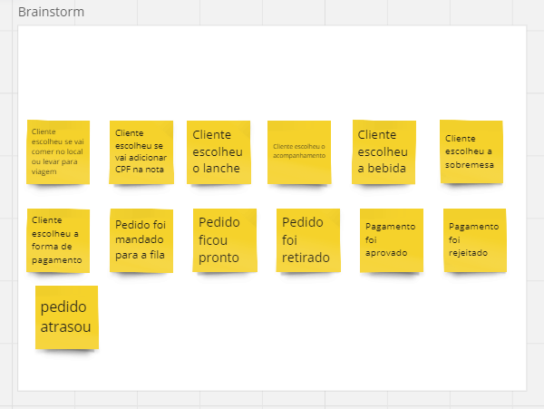
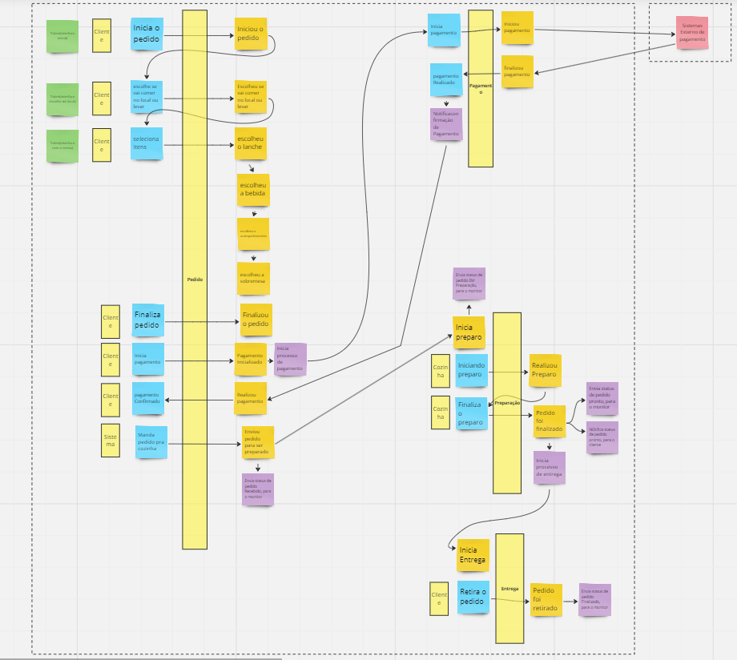
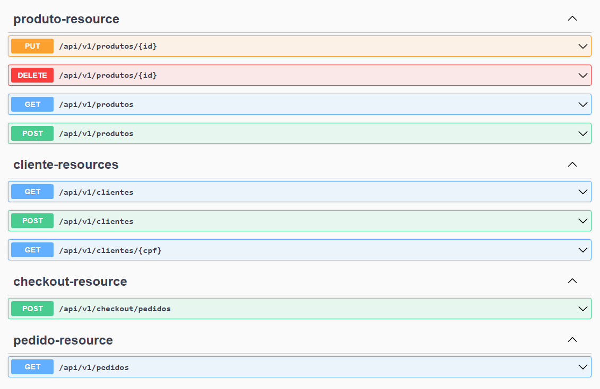

[](https://opensource.org/licenses/)

# Fase-1

## Stack inicial
- Spring-boot
- Java 20
- PostgreSQL

## brainstorm realizado




## Rodando localmente

Clone o projeto
```bash
  $ git clone [https://link-para-o-projeto](https://github.com/flaviokovhub/tech-challenge.git)
```

Peças a serem executada via docker-compose
> 1 - backend jfood-api

> 2 - base de dados relacional postgreSQL
```bash
 services:
  backend:
    image: 'flaviokov/jfood-api:1.0'
    environment:
      - 'DB_URL=jdbc:postgresql://postgres:5432/jfood'
      - 'DB_PASS=jfood'
      - 'DB_USER=jfood'
    ports:
      - '8080:8080'
    depends_on:
      - postgres
  postgres:
    image: 'postgres:latest'
    environment:
      - 'POSTGRES_DB=jfood'
      - 'POSTGRES_PASSWORD=jfood'
      - 'POSTGRES_USER=jfood'
    ports:
      - '5432:5432'
  pgadmin:
    image: 'dpage/pgadmin4'
    ports:
      - "8888:80"
    environment:
      PGADMIN_DEFAULT_EMAIL: 'jfood@jfood.com'
      PGADMIN_DEFAULT_PASSWORD: 'jfood' 
```

Execute o docker-compose

Entre no diretório  tech-challenge/fase-1/jfood/ci

```bash
  $ cd ci/
```
Execute para iniciar o ambiente:
```bash
  $ docker-compose up
```

Execute para parar o ambiente:
```bash
  $ docker-compose down
```

Acessando o Swagger:
> http://localhost:8080/swagger-ui/index.html#/

Endpoints:


Collections:
```bash
  $ cd assets/
```


[swagger-screenshot]: assets/swagger-ex.png
